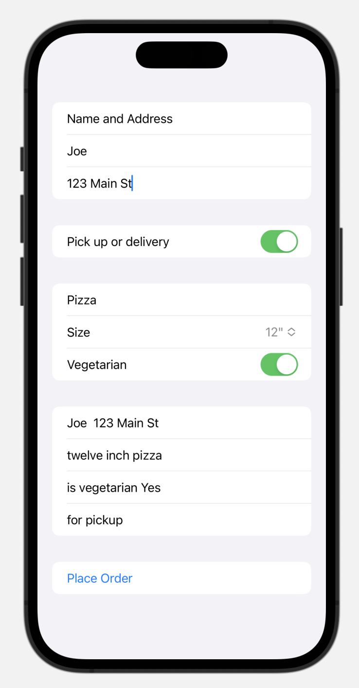

# Exploring SwiftUI Pt.2

## [Slides](https://tech-at-du.github.io/ACS-1410-Introduction-to-Swift/Slides/06-SwiftUI2/README.html ':ignore')

<!-- > -->

## Suggested accounts to follow 😬

- [Paul Hudson](https://www.youtube.com/channel/UCmJi5RdDLgzvkl3Ly0DRMlQ)
- [Sean Allen](https://www.youtube.com/channel/UCbTw29mcP12YlTt1EpUaVJw)
- [Lets Build That App](https://www.youtube.com/channel/UCuP2vJ6kRutQBfRmdcI92mA)
- [Code With Chris](https://www.youtube.com/user/CodeWithChris)
- [Swiftly Shivali](https://www.youtube.com/c/SwiftlyShivali/videos)
- [Mayuko](https://www.youtube.com/c/hellomayuko)

<!-- > -->

## Learning Objectives

By the end of this lesson, students should be able to:

- Refactor code to get separation of concerns
- Create views efficiently using Swift's constructs
- Understand the **@State** property wrapper
- Understand the **@Binding** property wrapper

<!-- > -->

## Refactoring Demo

Making our code more efficient and organized.

<!-- > -->

## Structs & Immutability

- Structs are immutable
- We use them all over the place with Swift.
- They are fixed values, rarely we will be changing them. (Think about Integers)

<!-- > -->

```swift
struct ContentView: View {
    var isAuthenticated = false
    var body: some View {
        Button(action: {
            self.isAuthenticated.toggle() // Error!
        }, label: {
            Text("auth is: \(isAuthenticated)")
        })
    }
}
```

This code produces an error: 

> Cannot use mutating member on immutable value: 'self' is immutable

<!-- > -->

## Property wrappers

**Allow us to add extra functionality to existing types**

Today we won't go deep on these, but during lab time definitely check out this resource:

[Property Wrappers - video](https://www.youtube.com/watch?v=lxdSiq8drXQ)

<!-- > -->

## @State

`@State` is a property wrapper that tells Swift that we will be changing the value of the property as our program runs.

When a `@State` property changes, SwiftUI automatically knows that it should reload the views to reflect the new state.

<!-- > -->

```swift
struct ContentView: View {
    @State var isAuthenticated = false // @State property wrapper

    var body: some View {
        Button(action: {
            self.isAuthenticated.toggle() 
        }, label: {
            Text("auth is: \(isAuthenticated.description)")
        })
    }
}
```

Using the @State property wrapper here solves the error you saw earlier. 

<!-- > -->

What if the user updates the value of the property? How can we tell Swift to make the updates in the view?

Bind the property to the view and bind the view back to the property.

**Two-way binding**

Data flows in both ways to stay in sync.

<!-- > -->

```swift
struct ContentView: View {
    @State var isAuthenticated = false
    @State var password = ""
    var body: some View {
        VStack{
            Button(action: {
                self.isAuthenticated.toggle()
            }, label: {
                Text("auth is: \(isAuthenticated.description)")
            })
            TextField("Enter your password", text: $password)
                .multilineTextAlignment(.center)
            Text("You entered:\(password)")
        }
    }
}
```

Important concept: `@State` is used to define variables that are used in a View. To _read_ a variable use it's name, for example: `password`. To update a vairable you must prefix the name with the `$`, for example: `$password`.

<!-- > -->

## The use of $

When you see a property being used by itself:

```swift
Text("You entered:\(password)")
```

Means we want the value to be used here. **We read the value.**

<!-- > -->

When you see a property with `$`:

```swift
TextField("Enter your password", text: $password)
```

Means the value is being accessed through the property wrapper. Swift handles the two-way binding. **We read and update the value.**

<!-- > -->

## @Binding

Use a binding to create a two-way connection between a property that stores data, and a view that displays and changes the data.

A binding connects a property to a source of truth stored elsewhere, instead of storing data directly.

<!-- > -->

```swift
// Create a PlayButton view
struct PlayButton: View {
    // Creates a binding to the var in ContentView (below)
    @Binding var isPlaying: Bool
    var body: some View {
        Button(action: {
            self.isPlaying.toggle()
        }) {
            Image(systemName: isPlaying ? "pause.circle" : "play.circle")
        }
    }
}
```

Now use the PlayButton in your ContentView. 

```Swift 
struct ContentView: View {
  @State var isPlaying = false
  
  var body: some View {
    VStack {
      PlayButton(isPlaying: $isPlaying)
        .font(.system(size: 100))
      
      Text(isPlaying ? "Playing" : "Paused")
    }
  }
}
```

<aside class"notes">
For example, a button that toggles between play and pause can create a binding to a property of its parent view using the Binding property wrapper.
</aside>

Important! When a variable exists in another view you'll use `@Binding`. This is case the `isPLaying` variable exists in the parent view, `ContentView`, but is read and set in the child view, `PlayButton`. 

Since the `isPlaying` property is used by both 

<!-- > -->

```swift
struct ContentView: View {
  @State var isPlaying = false
  
  var body: some View {
    VStack {
      PlayButton(isPlaying: $isPlaying)
        .font(.system(size: 100))
      
      Text(isPlaying ? "Playing" : "Paused")
    }
  }
}
```
<aside class ="notes">
The parent view declares a property to hold the playing state, using the
State property wrapper to indicate that this property is the value's source of truth.

When `PlayerView` initializes `PlayButton`, it passes a binding of its state property into the button's binding property. Whenever the user taps the PlayButton, the PlayerView updates its isPlaying state.
</aside>

<!-- > -->

## In Class Activity

Try and recreate this pizza order form with SwiftUI. 



Structure the form like this: 

```Swift
Form {
    Section { /* name and address */ }
    Section { /* pickup or delivery */ }
    Section { /* Pizza size and vege */ }
    Section { /* order summary */ }
    Section { /* place order button */ }
}
```

Read about Form: https://developer.apple.com/documentation/swiftui/form/

Read about Section: https://developer.apple.com/documentation/swiftui/section/

Use an `@State` var for each of the form input elements. 

- `inputName` String - TextField
- `inputAddress` String - TextField
- `selectedSize` enum - Picker
- `forPickup` Bool - Toggle
- `isVegetarian` Bool - Toggle

For input text use: 

```Swift
struct ContentView: View {
  @State var name = "" // define a var 

  var body: some View {
    TextField("Name", text: $name) // set the var here!
  }
}
```

Read about TextField here: https://developer.apple.com/documentation/swiftui/textfield/

For the Toggles use: 

```Swift
struct ContentView: View {
  // Define a variable
  @State var pickup = false
  
  var body: some View {
    // label, variable (since it can be set use $)
    Toggle("Pick up or delivery", isOn: $pickup)
  }
}
```

Read about Toggle here: https://developer.apple.com/documentation/swiftui/toggle/

For the picker you need to define an enum like this: 

```Swift
// enum of type PizzaSize
enum PizzaSize: String, CaseIterable, Identifiable {
  case eight, twelve, twenty
  var id: Self { self }
}
```

Use the enum with the picker like this: 

```Swift
struct ContentView: View {
  // selected 
  @State var selectedSize: PizzaSize = .twelve
  
  var body: some View {
    Picker("Pizza Size", selection: $selectedSize, content: {
      Text("8\"").tag(PizzaSize.eight)
      Text("12\"").tag(PizzaSize.twelve)
      Text("20\"").tag(PizzaSize.twenty)
    })
  }
}
```

Read about the picker here: https://developer.apple.com/documentation/swiftui/picker/

IN the summary section you will display the results of the form input. To do this use the variables you have defined. When *reading* a variable you don't use the $. 

```Swift
// Display the name
Text("\(name) ordered")
// Display selectedSize need to use the rawValue
Text("\(selectedSize.rawValue) inch pizza")
// Display isVegetarian, use a ternary 
Text("is vegetarian \(isVegetarian ? "Yes" : "No")")
// 
```


<!-- > -->

## Additional Resources

- [For Each - Hacking with Swift](https://www.hackingwithswift.com/books/ios-swiftui/why-does-self-work-for-foreach)
- [Hacking with Swift](https://www.youtube.com/watch?v=stSB04C4iS4)
- [Calculator Logic](https://github.com/TarokhDev2020/Calculator-for-SwiftUI)
- Swift UI Documentetion in Xcode for @Binding
